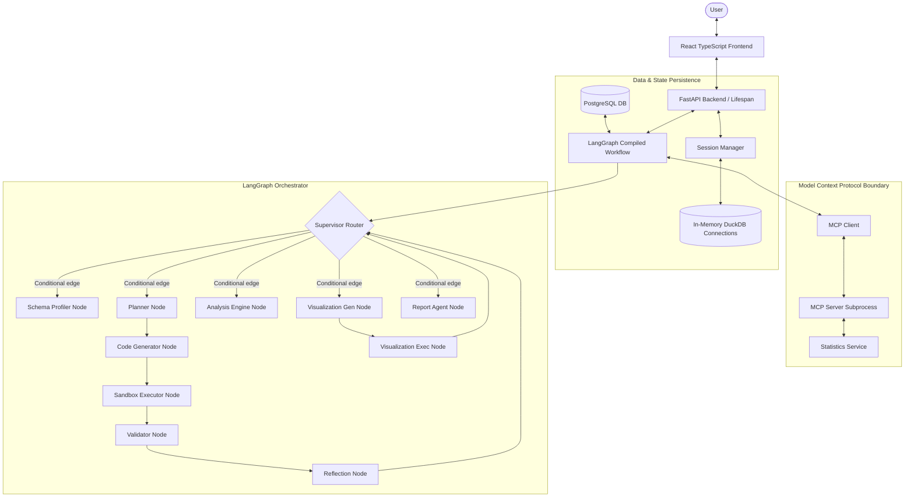
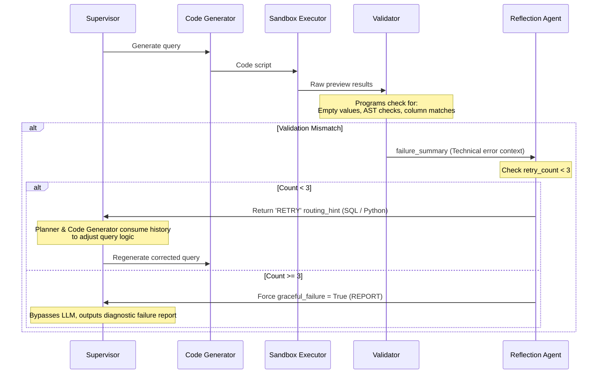

# DataAgent Pro

### Stateful Agentic Data Analysis with LangGraph

[](#)
[](#)
[](#)
[](#)
[](#)
[](#)
[](#)
[](#)
[](#)

DataAgent Pro is a **stateful agentic data analysis system** that plans, executes, validates, and refines SQL and Python analytical workflows. Orchestrated by **LangGraph**, it coordinates specialized workers to profile datasets, execute queries inside isolated sandboxes, verify results, and synthesize interactive Plotly reports grounded in computed facts.

---

## 📸 Product Preview & Screenshots

*Note: The following screenshot files must be captured manually and placed under `docs/screenshots/`.*

### A. Main Analysis Workspace
* **Command Executed:** `"Show the top 7 customers by total sales"`
* **Demonstrates:** Dynamic SQL planning, aggregation, and Plotly visualization.
* **Path:** `docs/screenshots/01_analysis_report.png`

### B. Conversational Follow-Up
* **Command Executed:** `"Show only the top 3"`
* **Demonstrates:** Persistent checkpoint restoration and follow-up intent resolution.
* **Path:** `docs/screenshots/02_followup_analysis.png`

### C. Chronological / Time-Series Analysis
* **Command Executed:** `"Show monthly total sales over time"`
* **Demonstrates:** Temporal aggregation and chronological trend detection.
* **Path:** `docs/screenshots/03_timeseries_analysis.png`

### E. Telemetry & Analytics Dashboard
* **Demonstrates:** Daily execution volumes, success metrics, and error breakdowns.
* **Path:** `docs/screenshots/04_analytics_dashboard.png`

### F. Developer Debug & Execution Trace
* **Demonstrates:** Detailed node transition timeline and raw generated SQL visibility.
* **Path:** `docs/screenshots/05_execution_trace.png`

---

## ⚡ Why This Project is Different

Most AI data assistants operate as basic "Chat-with-CSV" wrappers, passing entire datasets directly to LLMs or executing unchecked code. DataAgent Pro separates non-deterministic planning from deterministic math using a stateful compiler.

| Dimension | Basic Chat-with-CSV | DataAgent Pro |
| :--- | :--- | :--- |
| **Execution Strategy** | Linear LLM generation. | **Stateful supervisor-worker graph** orchestration. |
| **Calculation Boundary** | LLM computes math or writes raw script. | **Deterministic DuckDB, Pandas, and NumPy** execution. |
| **State Management** | Raw conversation window history. | **PostgreSQL-backed LangGraph checkpointing** per thread. |
| **Failure Handling** | Returns raw python stack traces or crashes. | **Validation and reflection loops** with feedback retries. |
| **Code Safety** | Runs arbitrary code without verification. | **AST security checks** and SQL diagnostics. |
| **Observability** | No metrics or node visibility. | **Chronological execution trace** and KPI dashboards. |
| **Tool Boundaries** | Tightly coupled functions. | **Process-isolated MCP tool boundaries** with fallbacks. |

---

## 🛠️ Core Engineering Highlights

### 1. LangGraph Supervisor-Worker Orchestration
The system routes requests using a central coordinator ([supervisor_node](file:///D:/Projects/autonomous-data-analyst-agent/backend/agents/nodes/supervisor.py#L144)). The supervisor assesses user intent, dynamically maps conversations to logical capabilities (SCHEMA, SQL, ANALYSIS, VISUALIZATION, REPORT), and branches execution. This hides internal node topologies and separates task planning from visual synthesis.

### 2. PostgreSQL Checkpoint Persistence
Utilizes `PostgresSaver` connection pooling to serialize and store conversation state ([graph.py](file:///D:/Projects/autonomous-data-analyst-agent/backend/agents/graph.py#L108)). The checkpointer saves transient execution states, planning steps, generated code, and results. This allows the system to reconstruct preceding metrics, schema profiles, and column definitions across server Restarts.

### 3. Verification & Safety Sandbox
Employs process-isolated code execution. Before execution, generated SQL is run through a dry-run validation checks (verifying `LIMIT` assertions, columns, and `GROUP BY` bounds in [sql_quality_validator.py](file:///D:/Projects/autonomous-data-analyst-agent/backend/services/sql/sql_quality_validator.py)). Python code undergoes AST analysis ([python_quality_validator.py](file:///D:/Projects/autonomous-data-analyst-agent/backend/services/python/python_quality_validator.py)) to reject imports outside a strict whitelist (`pandas`, `numpy`, `math`, `statistics`, `re`, `json`, `datetime`, `collections`) and block dangerous dynamic calls like `exec` and `eval`.

### 4. Grounded Reporting Engine
The report agent ([report_agent.py](file:///D:/Projects/autonomous-data-analyst-agent/backend/agents/nodes/report_agent.py#L425)) guarantees narrative reliability by generating deterministic summaries (shares, top categories, margins) through a statistical fact compiler ([fact_generator.py](file:///D:/Projects/autonomous-data-analyst-agent/backend/services/reporting/fact_generator.py)) before invoking the LLM. The LLM is forced to compose summaries adhering to strict family-specific semantic rules (e.g. contribution rules, correlation thresholds), completely blocking general buzzwords.

### 5. Multi-Tenant DuckDB Sessions with Auto-Restoration
Features thread-isolated DuckDB databases in memory ([session_manager.py](file:///D:/Projects/autonomous-data-analyst-agent/backend/services/session_manager.py#L10)). A background lifespan task evicts inactive sessions after 30 minutes of inactivity. If a user queries an evicted session, the backend automatically restores the in-memory database using the session's scratch CSV file ([is_csv_session](file:///D:/Projects/autonomous-data-analyst-agent/backend/mcp/data_access.py#L9)).

---

## 📐 System Architecture

### Main Workflow & Capabilities


---

## 🔄 How the Agentic Workflow Works

Below is the execution path for a standard request such as: `"Show the top 7 customers by total sales"`

```
User Question 
  → FastAPI Endpoint (/analyze)
  → Load Checkpoint State from Postgres (by Thread/Session ID)
  → Supervisor Node (Selects SQL capability based on schema keywords)
  → Schema Profiler Node (Profiles dataset columns and rows)
  → Planner Node (Structures SQL plan step-by-step)
  → Code Generator Node (Writes DuckDB SELECT query)
  → Sandbox Executor (Validates SQL semantics, executes in DuckDB, returns data preview)
  → Validator Node (Evaluates results programmatically & semantically using LLM check)
  → Reflection Node (Increments retry metrics or flags execution recovery)
  → Visualization Generator (Generates Plotly Specification parameters)
  → Visualization Executor (Renders Plotly Chart JSON via template library)
  → Report Agent (Generates numerical facts, queries LLM narrative, writes ReportLab PDF)
  → Database Persistence (Saves session reports and performance KPIs to Postgres)
  → React Frontend (Renders structured workspace reports and timeline executions)
```

---

## 🛠️ Validation, Reflection & Retry Loops

When a code execution crashes, returns empty rows, or misses columns, the validator blocks the response and starts a reflection chain.



---

## ⚖️ LLM vs. Deterministic Computation

DataAgent Pro relies on a hybrid execution strategy to ensure numeric correctness:

| Component | Execution Type | Responsibility | Source File |
| :--- | :--- | :--- | :--- |
| **Supervisor** | Hybrid (LLM + Regex) | Detects intent follow-ups and routes tasks | [supervisor.py](file:///D:/Projects/autonomous-data-analyst-agent/backend/agents/nodes/supervisor.py) |
| **Planner** | LLM | Maps out analytical logic and dimensions | [planner.py](file:///D:/Projects/autonomous-data-analyst-agent/backend/agents/nodes/planner.py) |
| **SQL Generator** | LLM | Writes syntax-specific SQL select queries | [code_generator.py](file:///D:/Projects/autonomous-data-analyst-agent/backend/agents/nodes/code_generator.py) |
| **Python Analyst** | LLM | Generates complex text-cleaning scripts | [python_analyst.py](file:///D:/Projects/autonomous-data-analyst-agent/backend/agents/nodes/python_analyst.py) |
| **SQL Quality Check**| Deterministic | Validates column schemas and query limits | [sql_quality_validator.py](file:///D:/Projects/autonomous-data-analyst-agent/backend/services/sql/sql_quality_validator.py) |
| **Python AST Check** | Deterministic | Parses AST to reject dangerous imports | [python_quality_validator.py](file:///D:/Projects/autonomous-data-analyst-agent/backend/services/python/python_quality_validator.py) |
| **Data Engine** | Deterministic | Executes analytical queries in DuckDB/Postgres | [data_access.py](file:///D:/Projects/autonomous-data-analyst-agent/backend/mcp/data_access.py) |
| **Statistics** | Deterministic | Computes pearson correlations and outliers | [statistics.py](file:///D:/Projects/autonomous-data-analyst-agent/backend/services/statistics.py) |
| **Grounded Facts** | Deterministic | Derives categories, sums, differences, and gaps | [fact_generator.py](file:///D:/Projects/autonomous-data-analyst-agent/backend/services/reporting/fact_generator.py) |
| **Plotly Charting** | Deterministic | Maps data types into plotly layouts | [visualization_executor.py](file:///D:/Projects/autonomous-data-analyst-agent/backend/agents/nodes/visualization_executor.py) |
| **Report Narrative** | LLM | Synthesizes insights matching semantic contracts | [report_agent.py](file:///D:/Projects/autonomous-data-analyst-agent/backend/agents/nodes/report_agent.py) |
| **Failure Summary** | Deterministic | Builds failure diagnostics without LLM calls | [failure_formatter.py](file:///D:/Projects/autonomous-data-analyst-agent/backend/services/reporting/failure_formatter.py) |

---

## 📡 Model Context Protocol (MCP) Integration

The system leverages the Model Context Protocol (MCP) as a clean tool integration boundary. LangGraph nodes delegate statistical operations and schema discovery to a local FastMCP subprocess over Stdio.

```
LangGraph Node (e.g. analysis_engine) 
  → MultiServerMCPClient (client.py)
  → subprocess connection (Stdio)
  → FastMCP Server (server.py)
  → executes statistics tool 
  → JSON output returned
```

### Registered MCP Tools
* `get_dataset_schema`: Profiles dataset structures and row counts.
* `calculate_correlation`: Computes numerical correlation matrices.
* `detect_outliers`: Detects dataset outliers using standard IQR bounds.
* `is_result_chartable`: Determines if dimensions are structurally chartable.

*Note: In the event of an MCP subprocess failure or network timeout, the client dynamically falls back to importing local deterministic libraries ([statistics.py](file:///D:/Projects/autonomous-data-analyst-agent/backend/services/statistics.py)).*

---

## 🛡️ Sandbox & Observability

### Safety Measures
* **Process-Isolated Execution:** Code runs inside isolated subprocesses with a default 10-second timeout to prevent CPU locks.
* **Environment Variable Whitelisting:** Subprocesses run with restricted environments (`PATH`, `TEMP`, `SYSTEMROOT`), keeping DB credentials and API keys inaccessible.
* **Model Failovers:** The backend supports ChatGroq `llama-3.3-70b-versatile` with an automated failover chain targeting Google’s `gemini-2.5-flash` using LangChain's `.with_fallbacks()` mechanism.

### Analytics Dashboard & Observability
The PostgreSQL database keeps track of execution stats, visible in the React frontend dashboard:
* **KPI Indicators:** Core metrics like Total Executions, Success Rates, First-Try Pass Rates, and Recovery Rates.
* **Failure distribution:** Breakdown chart of categories (Runtime, Structural, Semantic, Timeout, Visualization) stored inside Postgres JSONB columns.
* **Execution Trace:** Real-time chronological timeline mapping of LangGraph steps, execution speeds, and query details.

---

## 📦 Tech Stack

| Domain | Verified Technology |
| :--- | :--- |
| **Agent Orchestration** | LangGraph, LangChain Core |
| **API Backend** | FastAPI, Uvicorn |
| **Database & Analytics** | PostgreSQL, DuckDB, Pandas, NumPy |
| **State Persistence** | `psycopg_pool` (Connection Pooling), `PostgresSaver` |
| **LLM Providers** | ChatGroq (`llama-3.3-70b-versatile`), ChatGoogleGenerativeAI (`gemini-2.5-flash`) |
| **Tool Protocol** | FastMCP (Model Context Protocol), MultiServerMCPClient |
| **Frontend Framework** | React 18, TypeScript, TailwindCSS, Vite |
| **Visualization** | Plotly.js |
| **Reporting** | ReportLab PDF Library |

---

## 📂 Project Structure

```
autonomous-data-analyst-agent/
│
├── backend/
│   ├── agents/                   # LangGraph Node Orchestration
│   │   ├── nodes/                # Agent capabilities (supervisor, planner, code gen, validator)
│   │   ├── graph.py              # StateGraph compilation and checkpointer
│   │   ├── state.py              # TypedDict state structure
│   │   └── capability_registry.py# Capabilities routing definitions
│   │
│   ├── mcp/                      # MCP Client and data access wrappers
│   ├── mcp_server/               # FastMCP Server exposing tools
│   ├── services/                 # Business logic
│   │   ├── reporting/            # Fact extraction, report modes, recommendations
│   │   ├── sql/                  # SQL quality validator
│   │   ├── python/               # AST python validator
│   │   └── statistics.py         # Outlier & Correlation algorithms
│   │
│   ├── database/                 # Postgres connection pool and DB queries
│   └── main.py                   # FastAPI app with background workers & lifespan
│
├── frontend/
│   ├── src/
│   │   ├── components/           # UI layout, chat boxes, Plotly wrappers
│   │   ├── pages/                # Workspace and Analytics screens
│   │   ├── hooks/                # useAnalytics state wrapper
│   │   └── services/             # API communication layer
│   └── package.json
│
├── docker-compose.yml            # Postgres database container
└── requirements.txt              # Backend dependencies
```

---

## 🚀 Getting Started

### 1. Database Setup
Start the local PostgreSQL container (uses version 16-alpine):
```bash
docker-compose up -d
```

### 2. Backend Installation
1. Create and activate a python virtual environment:
   ```bash
   python -m venv .venv
   # Windows:
   .venv\Scripts\Activate.ps1
   # Linux/macOS:
   source .venv/bin/activate
   ```
2. Install python dependencies:
   ```bash
   pip install -r requirements.txt
   ```
3. Copy environment template to `.env` and set your api keys:
   ```bash
   cp .env.example .env
   ```
   *Edit `.env` and configure `GROQ_API_KEY` (required) and `GOOGLE_API_KEY` (optional fallback).*
4. Start FastAPI server:
   ```bash
   uvicorn backend.main:app --reload
   ```
   *The backend will boot on `http://localhost:8000`.*

### 3. Frontend Installation
1. Navigate to frontend directory and install npm packages:
   ```bash
   cd frontend
   npm install
   ```
2. Start Vite server:
   ```bash
   npm run dev
   ```
   *The frontend runs on `http://localhost:5173`.*

---

## 🔍 Supported Analytical Inquiries

* **Descriptive Summary:** *"Run summary statistics on sales"*
* **Rankings:** *"Show the top 7 customers by total sales"* (Follow-up: *"Show only the top 3"*)
* **Timeline Trend:** *"Show monthly total sales over time"*
* **Contribution Shares:** *"Show the percentage contribution of total sales by deal size"*
* **Correlation:** *"Calculate the correlation between quantity ordered, price each, and sales"*
* **Outliers:** *"Detect outliers in sales"*

---

## 🔒 Limitations & Future Improvements

### Current Bounded Limitations
* **Local Process Sandbox:** Python scripts run inside standard subprocess sandboxes rather than isolated Docker containers or VM environments.
* **CSV Data Scope:** The upload endpoint expects standard comma-separated tabular files (CSVs) with encoding fallbacks.
* **FastMCP Transport:** Exposes tools using standard input/output (stdio) streams.

### Future Improvements
* Container-level isolation for generated Python code runs.
* Native DB connectors (Postgres, BigQuery, Snowflake) in addition to CSV imports.
* Automated API token cost telemetry inside the database.

---

## 👤 Portfolio Context
This repository was developed as an AI engineering portfolio project demonstrating state-guided LangGraph orchestrators, execution sandboxes, custom Model Context Protocol boundaries, and telemetry metrics.
