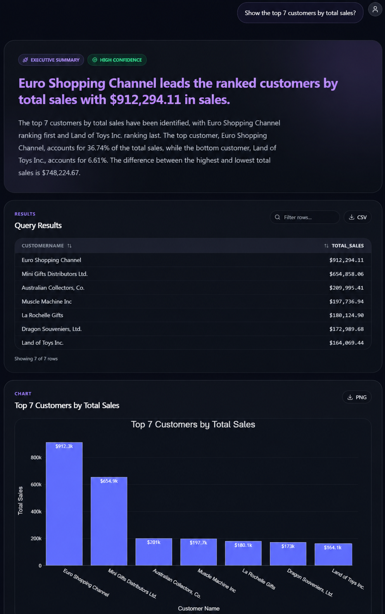
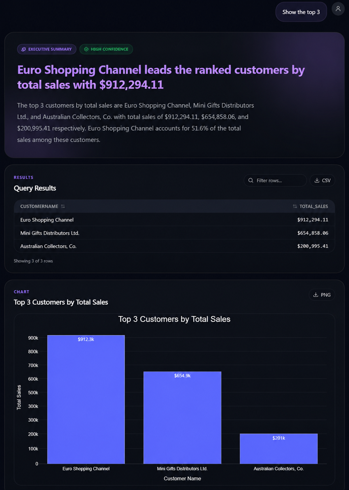
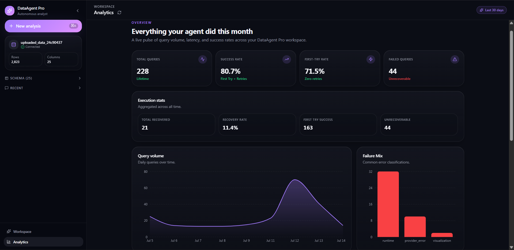
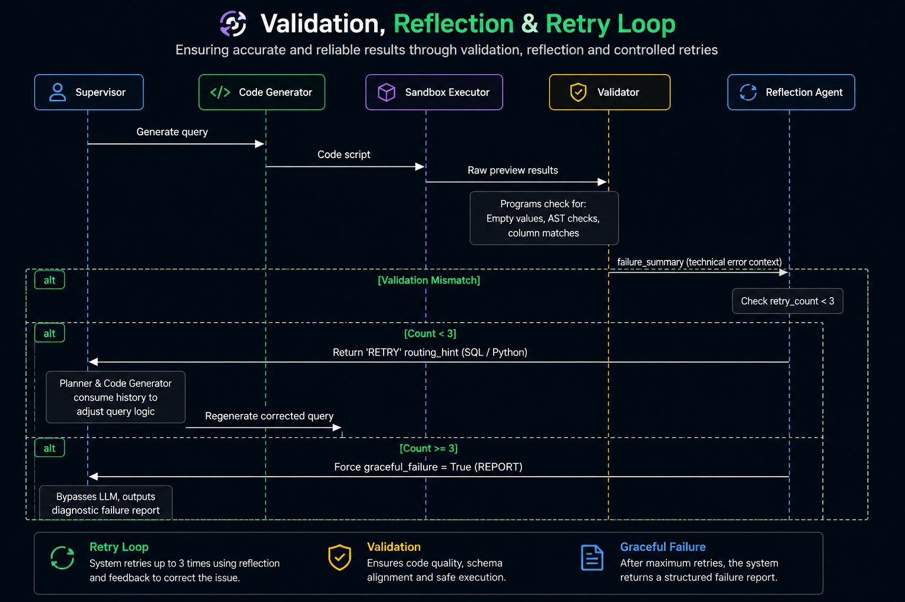

<div align="center">

# DataAgent Pro

### Stateful Multi-Agent Data Analysis with LangGraph

[](#)
[](#)
[](#)
[](#)
[](#)
[](#)
[](#)
[](#)
[](#)

<p align="center" width="80%">

**DataAgent Pro** is a **stateful agentic data analysis system** built with **LangGraph** that plans, executes, validates, and explains SQL and Python analytical workflows.

It combines **LLM reasoning**, **deterministic execution**, **safe code validation**, and **interactive visualizations** to deliver reliable, grounded analytical insights.

</p>

</div>

---

# 📸 Product Preview & Screenshots

Follow the complete workflow from uploading a dataset to receiving validated insights, visualizations, generated SQL, and execution analytics.


## 1️⃣ Dataset Upload

Upload a CSV dataset to begin a new analysis session. The agent automatically profiles the dataset and prepares it for downstream analytical tasks.

<p align="center">
  
</p>

---

## 2️⃣ Main Analysis Workspace

The primary workspace where users ask analytical questions in natural language. The system generates an executive summary, executes SQL/Python, validates results, and displays the execution pipeline in real time.

<p align="center">
  
</p>

---

## 3️⃣ Example Analysis — Monthly Sales Trend

A complete analytical report including:

- Executive Summary
- Query Results
- Interactive Visualization
- Statistical Insights

<p align="center">
  
</p>

---

## 4️⃣ Conversational Follow-up Analysis

The agent maintains conversation state using LangGraph checkpointing, allowing follow-up questions without re-uploading the dataset.

Example:

> "Show the top 3"

The system automatically understands the previous analytical context.

<p align="center">
  
</p>

---

## 5️⃣ Explainable AI & Debug Information

Every analytical result is fully transparent.

The agent exposes:

- Generated SQL
- LLM reasoning
- Execution plan
- Runtime metadata

allowing users to inspect exactly how every answer was produced.

<p align="center">
  
</p>

---

## 6️⃣ Analytics & Observability Dashboard

The built-in analytics dashboard tracks system performance, execution latency, retry rates, recovery statistics, and historical execution metrics for monitoring agent behavior.

<p align="center">
  
</p>

---

## ⚡ Why This Project is Different

Many AI data analysis tools primarily generate SQL or Python using an LLM and return the result directly. DataAgent Pro combines **LLM reasoning** with **deterministic execution**, **stateful workflows**, and **validation pipelines** to produce more reliable analytical results.

| Capability | Typical AI Data Assistant | DataAgent Pro |
| :--- | :--- | :--- |
| **Workflow** | Single-step LLM response | **Stateful LangGraph multi-agent workflow** |
| **Calculations** | Performed or generated by the LLM | **Executed deterministically using DuckDB, Pandas & NumPy** |
| **Conversation Memory** | Limited chat history | **Persistent LangGraph checkpoints with PostgreSQL** |
| **Error Recovery** | Stops on failures | **Validation, reflection, and automatic retries** |
| **Execution Safety** | Limited validation | **SQL validation and Python AST security checks** |
| **Explainability** | Final answer only | **Generated SQL, execution plan, reasoning, and reports** |
| **Observability** | Minimal execution visibility | **Pipeline timeline, execution metrics, and analytics dashboard** |
| **Tool Integration** | Direct tool calls | **MCP-based tool architecture with fallback support** |

---

## 🛠️ Core Engineering Highlights

- **LangGraph Supervisor** – Routes requests to specialized workers for modular execution.
- **Persistent Memory** – PostgreSQL checkpoints preserve conversation state across sessions.
- **Safe Code Execution** – SQL validation and Python AST checks improve reliability and security.
- **Grounded AI Reports** – The LLM explains deterministic results instead of generating numbers.
- **Session Isolation** – Each analysis runs in an independent DuckDB session with automatic cleanup.

---

## 🏗️ System Architecture

DataAgent Pro follows a **stateful multi-agent architecture** built with **LangGraph**. A central Supervisor coordinates specialized workers for planning, execution, validation, visualization, and reporting, while PostgreSQL preserves workflow state across sessions.

<p align="center">
  
</p>
---

## 🔁 Validation, Reflection & Retry Loop

Every generated SQL or Python script is validated before execution. If validation fails or the results are unreliable, the system automatically reflects on the failure, regenerates the query, and retries execution. After the retry limit is reached, it returns a structured failure report instead of an incorrect response.

<p align="center">
  
</p>

---

## ⚖️ LLM vs. Deterministic Execution

DataAgent Pro uses a hybrid approach where **LLMs handle reasoning** while **deterministic code performs calculations and validation**. This ensures reliable analytical results and reduces hallucinations.

| Component | Execution | Responsibility |
| :--- | :--- | :--- |
| **Supervisor** | Hybrid | Routes requests to the appropriate workflow. |
| **Planner** | LLM | Creates the analysis plan. |
| **SQL / Python Generator** | LLM | Generates SQL queries or Python code. |
| **Validation Layer** | Deterministic | Validates SQL structure and Python safety. |
| **Data Engine** | Deterministic | Executes queries using DuckDB and Pandas. |
| **Statistics Engine** | Deterministic | Computes aggregations, correlations, and outliers. |
| **Visualization Engine** | Deterministic | Generates Plotly charts from validated results. |
| **Report Generator** | Hybrid | Uses deterministic facts and an LLM to generate natural language summaries. |
| **Failure Handler** | Deterministic | Creates diagnostic reports and manages retry logic. |

---

## 🔌 Model Context Protocol (MCP)

The project uses **Model Context Protocol (MCP)** to separate the LangGraph workflow from external tools. Instead of calling utility functions directly, the agent communicates with an MCP server that provides reusable analytical tools.

### MCP Tools

- Dataset schema profiling
- Correlation analysis
- Outlier detection
- Chart recommendation

If the MCP server is unavailable, the system automatically falls back to local deterministic implementations to ensure uninterrupted execution.

---

## 🛡️ Safe Execution

Generated SQL and Python code are validated before execution.

- SQL validation prevents common query errors.
- Python AST validation blocks unsafe imports and dangerous functions.
- Code runs inside isolated subprocesses with execution timeouts for safer execution.

## 📊 Observability

The system records execution metrics and workflow traces, allowing users to monitor:

- Execution success rate
- Retry and recovery statistics
- Execution timeline
- System performance metrics

These insights are displayed through an integrated analytics dashboard.

---

## 📦 Tech Stack

| Category | Technologies |
| :--- | :--- |
| **Frontend** | React, TypeScript, Tailwind CSS, Vite |
| **Backend** | FastAPI, Python |
| **AI Framework** | LangGraph, LangChain |
| **LLMs** | Groq (Llama 3.3 70B), Gemini 2.5 Flash |
| **Database** | PostgreSQL, DuckDB |
| **Data Processing** | Pandas, NumPy |
| **Visualization** | Plotly |
| **Reporting** | ReportLab |
| **Tool Integration** | Model Context Protocol (MCP) |

---

## 📂 Project Structure

```text
autonomous-data-analyst-agent/
│
├── backend/          # FastAPI + LangGraph workflow
├── frontend/         # React application
├── screenshots/      # README images
├── docker-compose.yml
├── requirements.txt
└── README.md
```

---

## 🚀 Getting Started

### 1. Clone the Repository

```bash
git clone <repository-url>
cd autonomous-data-analyst-agent
```

### 2. Start PostgreSQL

```bash
docker-compose up -d
```

### 3. Backend Setup

```bash
python -m venv .venv

# Activate environment
# Windows
.venv\Scripts\activate

# Linux / macOS
source .venv/bin/activate

pip install -r requirements.txt

cp .env.example .env
```

Configure your API keys inside `.env`.

Start the backend:

```bash
uvicorn backend.main:app --reload
```

### 4. Frontend Setup

```bash
cd frontend

npm install

npm run dev
```

Open:

- Frontend → `http://localhost:5173`
- Backend → `http://localhost:8000`

---

## 💬 Example Queries

- "Show the top 7 customers by total sales."
- "Show monthly sales trends."
- "Calculate the correlation between sales and quantity."
- "Detect outliers in sales."
- "Show the percentage contribution by deal size."

---

## 🔒 Limitations

- Supports CSV datasets only.
- Python code runs inside subprocess-based sandboxes rather than containers.
- MCP communication currently uses local stdio transport.

---

## 🚀 Future Improvements

- Container-based code execution.
- Support for external databases (PostgreSQL, Snowflake, BigQuery).
- Token usage and cost monitoring.

---

## ⭐ Key Takeaways

This project demonstrates practical AI engineering concepts including:

- Multi-agent orchestration with LangGraph
- Stateful workflows and checkpointing
- Safe SQL and Python execution
- MCP-based tool integration
- Reflection and retry mechanisms
- Interactive analytics and reporting

## 📄 License

This project is licensed under the **MIT License**. See the `LICENSE` file for details.


## 👨‍💻 Author

**Chetan VK**

B.Tech in Artificial Intelligence & Data Science
